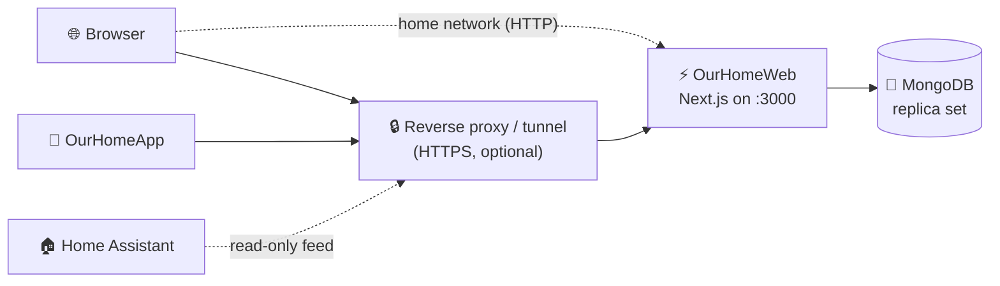

<div align="center">

# 🏡 OurHomeWeb

**A self-hosted, mobile-first command center for running a household.**

Chores, shopping, inventory, bills, a shared calendar, and household requests, <br>
with roles for every member of the home.

[](https://nextjs.org)
[](https://react.dev)
[](https://www.typescriptlang.org)
[](https://tailwindcss.com)
<br>
[](https://www.prisma.io)
[](https://www.mongodb.com)
[](./docker.example)
[](#-deploy-with-docker)

[Features](#-features) · [Requirements](#-requirements) · [Deploy](#-deploy-with-docker) · [Configuration](#configuration) · [Development](#-local-development) · [Architecture](./docs/ARCHITECTURE.md) · [📱 Android app](https://github.com/EOSOClub/OurHomeApp)

</div>

---

## ✨ Features

<table>
<tr>
<td width="50%" valign="top">

### ✅ Tasks & chores
Recurring chores, one-off tasks, and step-by-step checklists, assigned to the people who do them.

### 🛒 Shopping lists
A shared list the whole household can add to and tick off.

### 📦 Inventory
Track what's in the house, forecast when it runs out, and link items to **NFC tags** for one-tap updates.

### 💸 Bills & payments
Keep upcoming bills and what's been paid in one place. Bills and payments are **imported from Paperless-ngx** (email and phone photos), with payments matched to their bill automatically.

</td>
<td width="50%" valign="top">

### 📅 Calendar
One household calendar for everything with a date on it.

### 🎬 Requests
Movie/TV and maintenance requests, with deadlines.

### 🔔 Notifications & reminders
In-app notifications plus a reminder sweep that runs inside the app, and optional **instant phone alerts** through Firebase.

### 🛡️ Roles & permissions
Role-based access for every member, plus built-in bug reports.

</td>
</tr>
</table>

## 🧩 Requirements

| Needs | For | Where |
| --- | --- | --- |
| **MongoDB replica set** | Everything (required) | [OurHomeServices → mongo](https://github.com/EOSOClub/OurHomeServices/tree/main/mongo) |
| **Paperless-ngx** | Bills: collecting and archiving bill emails and photos | [OurHomeServices → paperless](https://github.com/EOSOClub/OurHomeServices/tree/main/paperless) |
| **Proton Mail Bridge** | Bills by email, if your mail is Proton | [OurHomeServices → proton-bridge](https://github.com/EOSOClub/OurHomeServices/tree/main/proton-bridge) |

> [!NOTE]
> Documents tagged `bill` / `bill-payment` in Paperless become bills and payments automatically. Setup: [docs/paperless-import.md](./docs/paperless-import.md).

> [!TIP]
> **Prefer your phone?** The companion Android app, **[OurHomeApp](https://github.com/EOSOClub/OurHomeApp)**, uses this site's API and adds NFC tag scanning and phone notifications.

## 🧱 Stack

| Layer | Tech |
| --- | --- |
| **Framework** | Next.js 16 (App Router), React 19, TypeScript |
| **UI** | Tailwind CSS v4, shadcn-style components |
| **Data** | Prisma 6 on MongoDB (single-node replica set) |
| **Auth** | Better Auth: username/password, HTTP-only cookies, roles |
| **Client & validation** | TanStack Query, Zod |
| **Testing** | Vitest |
| **Deploy** | Docker Compose ([`docker.example/`](./docker.example)) |



## 🐳 Deploy with Docker

Deployment lives in a `docker/` folder that is **gitignored**, so your real config and secrets never enter the repo. Start from the public template:

```bash
git clone https://github.com/EOSOClub/OurHome.git OurHomeWeb
cd OurHomeWeb
cp -r docker.example docker
cp .env.example .env                   # database URL + two secrets
cd docker
./deploy.sh                            # or: docker compose --env-file ../.env up -d --build
```

`deploy.sh` (or `deploy.ps1` on Windows) builds and starts the app, waits until it responds, and prints its address.

Then open `http://<server-ip>:3000` from any device on your network. On a fresh install the **setup page** asks for the household name and an admin username and password, then lets you add everyone else (username, password, optional email). No accounts live in `.env`.

> [!IMPORTANT]
> Docker runs **only the web app**. It needs a MongoDB **replica set**: set it up first with **[OurHomeServices](https://github.com/EOSOClub/OurHomeServices)** (or bring your own) and point `SERVER_DATABASE_URL` at it. The reminder sweep runs inside the app.

> [!NOTE]
> The web container serves plain HTTP on port 3000 to your home network. For access from outside, put a tunnel or reverse proxy (Cloudflare Tunnel, Caddy, nginx…) in front for HTTPS and set `PUBLIC_URL`. Never forward the port on your router.

📖 Full walkthrough and every setting: [`docker.example/README.md`](./docker.example/README.md)

<a id="configuration"></a>

## ⚙️ Configuration

All configuration lives in one `.env` in the repo root, used by both local dev and the Docker deploy. Every setting is documented in [`.env.example`](./.env.example). The compose file loads it into the container and swaps in the server-only values (`PUBLIC_URL`, `SERVER_*`).

<details>
<summary><b>The essentials</b> (click to expand)</summary>
<br>

| Setting | What it's for |
| --- | --- |
| `APP_NAME` | Name shown in the browser, sign-in page and emails (default "Our Home") |
| `SERVER_DATABASE_URL` | Your MongoDB replica set, as the container reaches it |
| `PUBLIC_URL` | Optional `https://` address from outside, for email links (server) |
| `WEB_HOST_PORT`, `WEB_BIND` | Port, and whether the home network can reach it (server) |
| `BETTER_AUTH_URL`, `DATABASE_URL` | Local dev URL and database |
| `BETTER_AUTH_SECRET` | Session signing secret |
| `CRON_SECRET` | Optional: trigger a reminder sweep via `/api/cron/reminders` |
| `SERVER_SMTP_HOST`, `SMTP_*`, `CONTACT_FORWARD_TO`, `BUG_REPORT_EMAIL` | Optional email (server only) |
| `SERVER_TURNSTILE_*` | Optional contact-form CAPTCHA (server only) |
| `SERVER_PAPERLESS_URL`, `SERVER_PAPERLESS_TOKEN`, `PAPERLESS_PUBLIC_URL` | Optional bill import from Paperless-ngx (server only, [setup](./docs/paperless-import.md)) |
| `SERVER_FIREBASE_SERVICE_ACCOUNT` | Optional instant alerts for the Android app (server only, [setup](./docs/push-notifications.md)) |

</details>

## 💻 Local development

```bash
npm install
cp .env.example .env              # set DATABASE_URL to a MongoDB replica set
npm run db:generate
npm run db:push
npm run dev                       # http://localhost:3000, setup on first visit
```

| Script | Purpose |
| --- | --- |
| `npm run dev` / `build` / `start` | Next.js dev / production build / serve |
| `npm run db:generate` | Generate the Prisma client |
| `npm run db:push` | Apply the schema to Mongo (no SQL migrations on Mongo) |
| `npm run db:reset` | Wipe the database (setup runs again on next visit) |
| `npm run test` | Vitest |
| `npm run typecheck` | `tsc --noEmit` |

## 🏠 Home Assistant

Home Assistant can show inventory on a dashboard from a read-only feed (`/api/integrations/inventory`). See [`HomeAssistant/display.yaml`](./HomeAssistant/display.yaml) and [`docs/home-assistant.md`](./docs/home-assistant.md).

> [!NOTE]
> NFC scanning itself now happens in the [Android app](https://github.com/EOSOClub/OurHomeApp).

## 📚 Docs

| Doc | What's in it |
| --- | --- |
| [Architecture](./docs/ARCHITECTURE.md) | How the app is designed |
| [Permissions](./docs/permissions.md) | Roles and what each can do |
| [Adding NFC tags](./docs/adding-nfc-tags.md) | Setting up tags for inventory items |
| [Home Assistant](./docs/home-assistant.md) | Dashboard integration |
| [Instant phone alerts](./docs/push-notifications.md) | Firebase setup for the Android app |
| [Paperless bill import](./docs/paperless-import.md) | Bills and payments from Paperless-ngx |

## 🗂️ Project layout

```
src/
  app/setup/…             First-run setup (admin, then household members)
  app/(auth)/…            Sign-in, forgot/reset password
  app/(app)/…             Dashboard, tasks, shopping, inventory, bills, calendar,
                          requests, members, settings, notifications, profile
  app/api/…               Thin route handlers -> services (+ webhooks, cron)
  server/services/        Business logic (only layer touching Prisma)
  server/auth/            Better Auth config + session helpers
  server/api/http.ts      Auth + permissions + validation + rate-limit wrapper
  lib/                    Zod schemas, enums, DTOs, permissions, helpers
  components/             UI primitives + feature components
prisma/                   Schema (models + mongodb datasource)
scripts/                  paperless-preview.ts
docker.example/           Deployment template (copy to docker/, which is gitignored)
HomeAssistant/            Example Home Assistant config
docs/                     Runbooks
```

---

<div align="center">
<sub>🏡 Built for one household, shared for yours. · Companion app: <a href="https://github.com/EOSOClub/OurHomeApp">OurHomeApp</a></sub>
</div>
